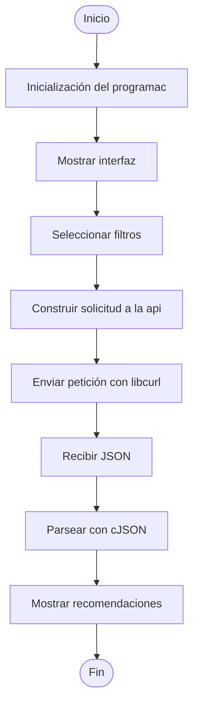

# Proyecto Final - Recomendador de Películas Personalizado

Daniel Castro (C21931), Sofía Castro (C5D998) y Marcelo Villalobos (C5K960)

## Descripción

El proyecto consiste en una herramienta que permite al usuario obtener recomendaciones cinematográficas personalizadas mediante la selección de filtros consumiendo la API pública de The Movie Database (TMDB).

La selección de peliculas se realiza con base a filtros que el usuario selecciona, como:

- Género
- Año de lanzamiento
- Plataforma de Streaming

Con base a estos flitros se realiza una busqueda en la API para obterner las películas que concuerdan con lo seleccionado. Posteriormente se seleccionan las películas con mayor ranking para ser recomendadas al usuario. 


## Funcionalidades implementadas

El proyecto fue diseñado siguiendo una estructura modular, donde cada componente cumple un objetivo en específico.

El módulo de interfaz gráfica administra la interacción con el usuario mediante GTK+ 3.
El módulo de comunicación con la API utiliza libcurl para realizar las solicitudes hacia TMDB.
El módulo de procesamiento de datos interpreta las respuestas JSON utilizando cJSON.
El programa principal integra todos los módulos.

## Diagrama de flujo



## Estructura del repositorio

```
.
├── include/
│   ├── json_parseo.h
│   ├── api.h
│   ├── 
│   └── 
│
├── src/
│   ├── json_parseo.c
│   ├── api.c
│   ├── 
│   └── 
│
├── main.c
├── Makefile
└── README.md
```

### Descripción de los archivos

| Archivo/Directorio | Descripción |
|--------------------|-------------|
| `main.c` | Contiene la intregración de todo el proyecto. |
| `src/` | Implementación de las funciones correspondientes a cada librería. |
| `include/` | Header files con las declaraciones de funciones y estructuras. |
| `Makefile` | Compilación del proyecto. |

## Dependencias

Antes de realizar cualquier instalación ejecute: 

```bash
sudo apt update
```

### Gtk3
```bash
sudo apt install libgtk-3-dev
```

### libcurl
```bash
sudo apt install libcurl4-openssl-dev
```

### cJson
```bash
sudo apt install libcjson-dev
```

## Pasos para la ejecución

### Clonar el repositorio


```bash
git clone https://github.com/Sofi-Castro/ProyectoPBPA_Grupo8
cd ProyectoPBPA_Grupo8
```

En donde clonó el repositorio, cree una carpeta llamada imagenes. Es importante que se llame así. 

### API key

Para el uso de la api se requiere el consumo de una api key, para definir:


```bash
export TMDB_API_KEY="tu_api_key_aqui"
```

Si no tienes una, usa:

```bash
078c68fc57745dc1d802d151a59a9cc1
```

### Compilación

A continuación ejecute: 

```bash
make
```

Si la compilación es exitosa, se generará el ejecutable llamado:

```text
programa
```

### Ejecución

Para ejecutar el programa:

```bash
./programa
```

